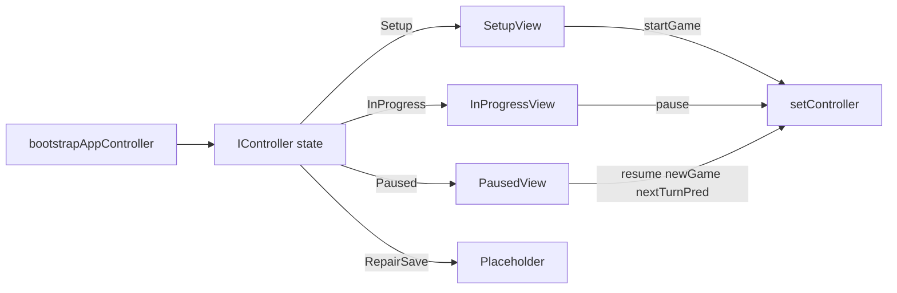

# Wire mode controllers into App and views

## Current state

- `[App.tsx](src/components/App/App.tsx)` holds one `GameLogic` instance, subscribes via `setOnGameModeChange`, and switches views on `GameMode` from `[game-logic.ts](src/core/game-logic.ts)`.
- `[bootstrapAppController](src/core/controllers/bootstrapAppController.ts)` already mirrors constructor routing: invalid save → `RepairSaveController`; empty turns → `SetupController`; else → `InProgressController`.
- Controllers use **App callbacks** for mode changes: `[SetupControllerCallbacks.startGame](src/core/controllers/SetupController.ts)`, `[InProgressControllerCallbacks.pause](src/core/controllers/InProgressController.ts)`, `[PausedControllerCallbacks](src/core/controllers/PausedController.ts)` (`resume`, `newGame`, `nextTurnWithPredeterminedCubes`). `[RepairSaveControllerCallbacks](src/core/controllers/RepairSaveController.ts)` exist for apply success (out of scope for UI).

## 1. `[App.tsx](src/components/App/App.tsx)`

- Keep a stable `[GameStorage](src/core/storage.ts)` instance (e.g. `useMemo(() => new GameStorage(), [])`).
- Replace `GameLogic` / `gameMode` with:

```ts
const [controller, setController] = useState<IController>(() =>
  bootstrapAppController(
    storage,
    setupCallbacks,
    inProgressCallbacks,
    repairCallbacks,
  ),
);
```

- **Callback wiring:** constructors need `setController` before first interaction. Use a `useRef` holding `setController` (set in `useEffect`) so factories passed into `bootstrapAppController` can call `replace(next: IController)` safely on user actions (same pattern as typical “bootstrap with callbacks that need setState”).

Implement four callback groups (can live in a small `appControllerTransitions.ts` next to App if you want to keep `App.tsx` thin):

| Callback                                    | Behavior (match existing `GameLogic` UX)                                                                                                                                                                                                                                                                                                                                                                                                                                                                                                                                      |
| ------------------------------------------- | ----------------------------------------------------------------------------------------------------------------------------------------------------------------------------------------------------------------------------------------------------------------------------------------------------------------------------------------------------------------------------------------------------------------------------------------------------------------------------------------------------------------------------------------------------------------------------- |
| **Setup `save**`                            | `storage.save(gameSaveData)`                                                                                                                                                                                                                                                                                                                                                                                                                                                                                                                                                  |
| **Setup `startGame**`                       | Replicate `[SetupView](src/components/SetupView/SetupView.tsx)` confirm today: `storage.clear()`, `const data = gameSaveData.asNewGame()`, build `GameState` via `GameState.tryFromGameSaveData(data)`, `new InProgressController(state, inProgressCallbacks)`, call `nextTurn()` once (first turn), then `setController(ipc)`. Persistence: `nextTurn` already saves inside `InProgressController`.                                                                                                                                                                          |
| **InProgress `save**`                       | `storage.save`                                                                                                                                                                                                                                                                                                                                                                                                                                                                                                                                                                |
| **InProgress `pause**`                      | `setController(new PausedController(gameState, pausedCallbacks))`                                                                                                                                                                                                                                                                                                                                                                                                                                                                                                             |
| **Paused `resume**`                         | `setController(new InProgressController(gameState, inProgressCallbacks))`                                                                                                                                                                                                                                                                                                                                                                                                                                                                                                     |
| **Paused `newGame**`                        | Match `[GameLogic.newGame](src/core/game-logic.ts)`: `storage.clear()`, then `setController(new SetupController(gameState.gameSaveData, setupCallbacks))`. Persist once with `storage.save(gameState.gameSaveData)` so refresh matches cleared key + current setup (same as relying on next setup edit, but saving immediately is safer).                                                                                                                                                                                                                                     |
| **Paused `nextTurnWithPredeterminedCubes**` | Match pause menu flow: view calls controller method then `resume`. Today `GameLogic` mutates **the same** `GameState` while status stays Paused, then `resume` flips to InProgress. Implement: create `new InProgressController(state, inProgressCallbacks)` with the **same** `GameState` reference from pause, call `nextTurnWithPredeterminedCubes(cubes)`, then `setController(new PausedController(state, pausedCallbacks))` so UI stays on pause with updated history. User’s `resume` then mounts a fresh `InProgressController` with timer seeded from the last turn. |
| **Repair `continueStartup**`                | If `gameState.gameSaveData.gameTurns.length === 0` → `SetupController(saveData, setupCallbacks)`; else → `InProgressController(state, inProgressCallbacks)`. (Only reachable when repair apply exists; see placeholder below.)                                                                                                                                                                                                                                                                                                                                                |
| **Repair `applyManualEdit**`                | No-op or TODO until manual repair exists.                                                                                                                                                                                                                                                                                                                                                                                                                                                                                                                                     |

- **Rendering:** `switch (controller.appMode())` using `[AppMode](src/core/controllers/IController.ts)` from `IController` (not `GameMode` from types). Map:
  - `Setup` → `<SetupView controller={...} />` (narrow type after check)
  - `InProgress` → `<InProgressView controller={...} />`
  - `Paused` → `<PausedView controller={...} />`
  - `RepairSave` → **placeholder only** (short copy: save invalid / repair needed). No editor; user asked to exclude `RepairView`. Document that invalid saves cannot be fixed in-app until that view exists.



## 2. Views

### `[SetupView.tsx](src/components/SetupView/SetupView.tsx)`

- Props: `controller: SetupController` (import from `[SetupController.ts](src/core/controllers/SetupController.ts)`).
- Initial `players` / `blockedNumbers` from `controller.getGameSaveData()` (same as today’s `gameLogic.state.gameSaveData`).
- Keep `useEffect` syncing to `controller.setPlayers` / `controller.setBlockedResults`.
- **Start confirmation:** call only `controller.startGame()`; remove `gameLogic.newGame()` + `gameLogic.nextTurn()` from the view (logic moves to App’s `startGame` callback).

### `[InProgressView.tsx](src/components/InProgressView/InProgressView.tsx)`

- Props: `controller: InProgressController`.
- Use `controller.getGameState()` for display; `controller.pause()` / `controller.nextTurn()` for actions.
- Pass `controller` into the timer hook (below).

### `[PausedView.tsx](src/components/PausedView/PausedView.tsx)`

- Props: `controller: PausedController`.
- Replace `GameLogic.getFreeRoll()` with `[PausedController.getFreeRoll](src/core/controllers/PausedController.ts)` (static).
- Replace `gameLogic.getDurationStats()` → `controller.getDurationStats()`.
- Replace `gameLogic.state.gameSaveData` → `controller.getGameState().gameSaveData`.
- Wire `resume`, `newGame`, `nextTurnWithPredeterminedCubes` to the controller (predetermined flow unchanged from the user’s perspective).

## 3. `[useGameTimer.ts](src/hooks/useGameTimer.ts)`

- Change parameter from `GameLogic` to `InProgressController`.
- Inside the interval: call `controller.timerTick()` (already mirrors `[GameLogic.timerTick](src/core/game-logic.ts)`).
- Read durations via `controller.getTurnTimerSeconds()` and `controller.getGameTimerSeconds()` instead of `gameLogic.state.getCurrentTurn().turnDuration` / `getGameDuration()` so the live timer stays authoritative.

## 4. Imports / exports

- Views can import controller classes from `src/core/controllers/...` (keeps `[src/core/index.ts](src/core/index.ts)` unchanged unless you want a single public entry — optional).

## 5. Tests / verification

- No `App.tsx` tests today; rely on manual pass: cold load, setup → start, pause → resume, pause → new game, predetermined cubes path, free roll modal.
- Existing `[bootstrap-app-controller.test.ts](src/core/__tests__/bootstrap-app-controller.test.ts)` stays valid.
- Optional: extract pure `buildTransitionCallbacks(...)` and unit-test transition outcomes (mock `storage`) — only if you want automated coverage without mounting React.

## 6. Controller changes (only if needed)

- **Default:** no controller edits required; behavior is already split correctly.
- **If TypeScript narrowing is noisy:** add small type guards in `[IController.ts](src/core/controllers/IController.ts)` or a local `controllerKinds.ts` (`function isSetup(c: IController): c is SetupController`).
- **If `PausedController.newGame` + `storage.clear` ordering matters:** confirm once that `GameState` passed to `SetupController` is the post-reset instance (it is today in `[PausedController.newGame](src/core/controllers/PausedController.ts)`).
