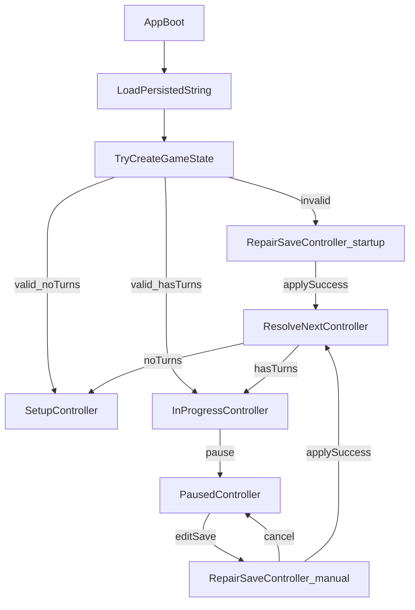

# Mode-Specific Controllers + RepairSave Refactor

## Goal

Refactor app flow so each mode has a dedicated controller (`RepairSave`, `Setup`, `InProgress`, `Paused`) and App owns controller lifecycle/transition orchestration. Implement startup and manual save-repair using the same RepairSave controller, while extracting non-UI logic from views.

## Scope and architecture decisions

- Keep core domain models (`GameState`, `GameSaveData`, persistence) as the source of truth for data validity.
- Use `GameSaveData` as the setup-phase model; `SetupController` should not require a `GameState` instance.
- Treat `GameState` as runtime gameplay state passed between `InProgressController` and `PausedController`.
- Replace broad `GameLogic` usage in UI flow with mode-specific controllers that implement a shared interface.
- Make `App.tsx` the only place that decides which controller to instantiate from persistence and transition intent.
- Treat `RepairSave` as a first-class mode with explicit `isStartupRecovery` behavior for cancel rules.

## Target controller contract

- Define a shared interface in core app-flow layer, e.g. `ModeController`:
  - `getMode(): AppMode` where `AppMode = 'RepairSave' | 'Setup' | 'InProgress' | 'Paused'`.
  - `toTransitionState()` (or equivalent) to expose serializable/minimal state needed to create next controller.
- Controllers:
  - `RepairSaveController`: stores raw persisted JSON, parse/validation/apply state, and `isStartupRecovery`.
  - `SetupController`: owns setup-only non-UI actions and current `GameSaveData`.
  - `InProgressController`: owns in-progress actions, `GameState`, and timer fields.
  - `PausedController`: owns paused actions and `GameState` (no timer fields).

## App bootstrap and transition rules

- In `[/Users/tal/Development/catan-web/src/components/App/App.tsx](/Users/tal/Development/catan-web/src/components/App/App.tsx)`, replace direct mode inference/rendering from `GameLogic` with `currentController` state.
- Startup load path:
  - Read persisted string.
  - If persisted save cannot produce valid `GameState` -> instantiate `RepairSaveController` with `isStartupRecovery=true`.
  - If valid and `gameTurns.length === 0` -> instantiate `SetupController` with `GameSaveData`.
  - Else -> instantiate `InProgressController` with timer state initialized.
- Runtime transitions:
  - View/controller requests mode change through App callback.
  - App creates new controller from previous controller transition payload.
  - App stores/replaces `currentController`, causing re-render.

## Refactor GameLogic responsibilities

- Split `GameLogic` responsibilities into:
  - reusable game-domain operations that stay in core helpers/services;
  - mode orchestration moved into controllers.
- Remove remaining app-flow decisions from `GameLogic` (mode routing, startup/manual repair routing, view-level transition concerns).
- Reuse existing deep validation/apply pipeline for repaired save data where appropriate, but invoked by controllers/App flow rather than view components.

## UI wiring per view

- `[/Users/tal/Development/catan-web/src/components/SetupView/SetupView.tsx](/Users/tal/Development/catan-web/src/components/SetupView/SetupView.tsx)`: consume `SetupController` API only.
- `[/Users/tal/Development/catan-web/src/components/InProgressView/InProgressView.tsx](/Users/tal/Development/catan-web/src/components/InProgressView/InProgressView.tsx)`: consume `InProgressController` API only (including timer-facing actions).
- `PausedView` (existing/new path): consume `PausedController` API only and expose “Edit save” request that transitions to `RepairSaveController` with `isStartupRecovery=false`.
- Add/finish dedicated `RepairSave` view component that binds to `RepairSaveController` state/actions (editor text, structural/deep errors, apply/cancel).

## Persistence + recovery behavior

- Startup invalid save:
  - enter `RepairSave` with persisted raw string;
  - cancel is blocked/hidden when `isStartupRecovery=true`.
- Manual repair from paused:
  - enter `RepairSave` seeded from current save JSON;
  - cancel allowed and returns to `Paused` without applying.
- Successful apply in repair:
  - parse to `GameSaveData`, then:
    - if no turns, instantiate `SetupController` with `GameSaveData`;
    - else construct `GameState` and instantiate `InProgressController` (or `PausedController` if explicit return policy requires it).

## Suggested implementation sequence

1. Add app-flow types and shared controller interface.
2. Implement `RepairSaveController` first (startup + manual variants).
3. Implement `SetupController` (`GameSaveData`-based), `InProgressController` (`GameState` + timers), and `PausedController` (`GameState`).
4. Refactor `App.tsx` to own `currentController` and bootstrap selection.
5. Rewire each view to receive/use its mode-specific controller.
6. Remove obsolete `GameLogic` mode orchestration paths and keep only reusable game-domain logic.
7. Complete repair UI integration and cancel/apply rules.
8. Update tests for controller transitions and repair outcomes.

## Testing plan

- Unit tests for bootstrap selection from persistence:
  - invalid persisted data -> `RepairSave(isStartupRecovery=true)`;
  - valid + no turns -> `SetupController` (receives `GameSaveData`);
  - valid + turns -> `InProgressController` (receives `GameState`).
- Controller transition tests:
  - `Paused -> RepairSave(manual) -> Cancel -> Paused`.
  - `RepairSave Apply -> Setup/InProgress` by turn-count rules.
- Data-shape tests:
  - `SetupController` APIs operate without requiring `GameState`.
  - `InProgressController <-> PausedController` transitions preserve shared `GameState`.
- Regression tests for timer handling in `InProgressController` and absence of timer fields in `PausedController`.
- UI integration tests (or component tests) ensuring each view uses only its controller contract.

## Flow diagram

