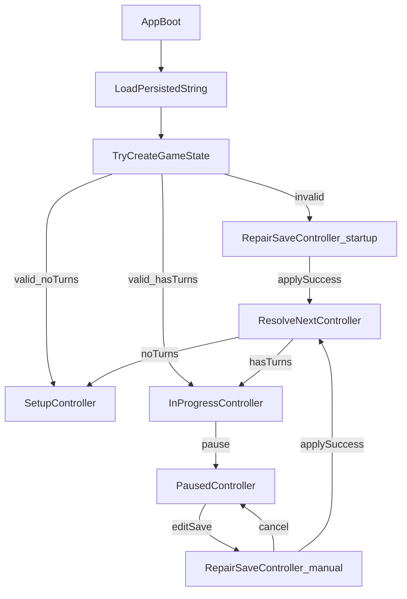

# Mode Controllers Refactor with IController

## Goal

Refactor app flow so each mode has a dedicated controller (`RepairSave`, `Setup`, `InProgress`, `Paused`) and App owns controller lifecycle/transition orchestration. Implement startup and manual save-repair using the same RepairSave controller, while extracting non-UI logic from views.

## Scope and architecture decisions

- Keep core domain models (`GameState`, `GameSaveData`, persistence) as the source of truth for data validity.
- Use `GameSaveData` as the setup-phase model; `SetupController` should not require a `GameState` instance.
- Treat `GameState` as runtime gameplay state passed between `InProgressController` and `PausedController`.
- Replace broad `GameLogic` usage in UI flow with mode-specific controllers that implement a shared interface.
- Make `App.tsx` the only place that decides which controller to instantiate from persistence and transition intent.
- Treat `RepairSave` as a first-class mode with explicit `isStartupRecovery` behavior for cancel rules.

## Controller files and shared contract

- Shared interface file: `[/Users/tal/Development/catan-web/src/core/controllers/IController.ts](/Users/tal/Development/catan-web/src/core/controllers/IController.ts)`
  - `appMode(): AppMode` where `AppMode = 'RepairSave' | 'Setup' | 'InProgress' | 'Paused'`.
  - transition export method (e.g. `toTransitionState()`) to provide minimal state for next-controller creation.
- Controller implementations:
  - `[/Users/tal/Development/catan-web/src/core/controllers/RepairSaveController.ts](/Users/tal/Development/catan-web/src/core/controllers/RepairSaveController.ts)`
  - `[/Users/tal/Development/catan-web/src/core/controllers/SetupController.ts](/Users/tal/Development/catan-web/src/core/controllers/SetupController.ts)`
  - `[/Users/tal/Development/catan-web/src/core/controllers/InProgressController.ts](/Users/tal/Development/catan-web/src/core/controllers/InProgressController.ts)`
  - `[/Users/tal/Development/catan-web/src/core/controllers/PausedController.ts](/Users/tal/Development/catan-web/src/core/controllers/PausedController.ts)`

## App bootstrap and transition rules

- In `[/Users/tal/Development/catan-web/src/components/App/App.tsx](/Users/tal/Development/catan-web/src/components/App/App.tsx)`, replace direct mode inference/rendering from `GameLogic` with `currentController` state (`IController`).
- Startup load path:
  - Read persisted string.
  - If persisted save cannot produce valid `GameState` -> instantiate `RepairSaveController` with `isStartupRecovery=true`.
  - If valid and `gameTurns.length === 0` -> instantiate `SetupController` with `GameSaveData`.
  - Else -> instantiate `InProgressController` with timer state initialized.
- Runtime transitions:
  - View/controller requests mode change through App callback.
  - App creates new controller from previous controller transition payload.
  - App stores/replaces `currentController`, causing re-render.

## Refactor GameLogic responsibilities

- Move app-flow/mode orchestration out of `GameLogic` into controllers.
- Keep reusable game-domain operations and deep validation/application in core domain logic.
- Ensure views do not route modes directly; they call controller/App transition handlers.

## UI wiring per view

- `[/Users/tal/Development/catan-web/src/components/SetupView/SetupView.tsx](/Users/tal/Development/catan-web/src/components/SetupView/SetupView.tsx)`: consume `SetupController` API only.
- `[/Users/tal/Development/catan-web/src/components/InProgressView/InProgressView.tsx](/Users/tal/Development/catan-web/src/components/InProgressView/InProgressView.tsx)`: consume `InProgressController` API only.
- Paused view: consume `PausedController` API only and expose “Edit save” request that transitions to `RepairSaveController` with `isStartupRecovery=false`.
- Dedicated `RepairSave` view binds to `RepairSaveController` state/actions (editor text, structural/deep errors, apply/cancel).

## Persistence and repair behavior

- Startup invalid save:
  - enter `RepairSave` with persisted raw string;
  - cancel is blocked/hidden when `isStartupRecovery=true`.
- Manual repair from paused:
  - enter `RepairSave` seeded from current save JSON;
  - cancel allowed and returns to `Paused` without applying.
- Successful apply in repair:
  - parse to `GameSaveData`, then:
    - if no turns, instantiate `SetupController` with `GameSaveData`;
    - else construct `GameState` and instantiate `InProgressController` (or `PausedController` if explicit return policy requires it).

## Suggested implementation sequence

1. Add `src/core/controllers/IController.ts` with `appMode` and shared mode/transition types.
2. Implement `RepairSaveController` (startup + manual variants).
3. Implement `SetupController` (`GameSaveData`), `InProgressController` (`GameState` + timers), and `PausedController` (`GameState`).
4. Refactor `App.tsx` to own `currentController: IController` and bootstrap selection.
5. Rewire each view to consume its mode-specific controller only.
6. Remove obsolete `GameLogic` mode orchestration paths.
7. Complete repair view integration and cancel/apply rules.
8. Add tests for routing and transitions.

## Testing plan

- Bootstrap selection tests:
  - invalid persisted data -> `RepairSave(isStartupRecovery=true)`.
  - valid + no turns -> `SetupController` (with `GameSaveData`).
  - valid + turns -> `InProgressController` (with `GameState`).
- Transition tests:
  - `Paused -> RepairSave(manual) -> Cancel -> Paused`.
  - `RepairSave Apply -> Setup/InProgress` by turn-count rules.
- Data-shape tests:
  - `SetupController` APIs do not require `GameState`.
  - `InProgressController <-> PausedController` preserve shared `GameState`.
- Regression tests for timer behavior in `InProgressController` and no timer fields in `PausedController`.

## Flow diagram

## Steps performed

1. Added `[/Users/tal/Development/catan-web/src/core/controllers/IController.ts](/Users/tal/Development/catan-web/src/core/controllers/IController.ts)` with:

- `IController`
- `AppMode`
- transition state types (`RepairSave`, `Setup`, `InProgress`, `Paused`)
- `appMode()` and `toTransitionState()` contract

1. Added `[/Users/tal/Development/catan-web/src/core/controllers/SetupController.ts](/Users/tal/Development/catan-web/src/core/controllers/SetupController.ts)` using `GameSaveData` only.
2. Added `[/Users/tal/Development/catan-web/src/core/controllers/InProgressController.ts](/Users/tal/Development/catan-web/src/core/controllers/InProgressController.ts)` using `GameState` plus `turnTimerSeconds` and `gameTimerSeconds`.
3. Added `[/Users/tal/Development/catan-web/src/core/controllers/PausedController.ts](/Users/tal/Development/catan-web/src/core/controllers/PausedController.ts)` using `GameState` only.
4. Added `[/Users/tal/Development/catan-web/src/core/controllers/RepairSaveController.ts](/Users/tal/Development/catan-web/src/core/controllers/RepairSaveController.ts)` with:

- startup/manual flag (`isStartupRecovery`)
- cancelability (`canCancel`)
- raw JSON state and separate structural/apply error buckets

1. Existing app wiring was intentionally not modified, per request.
