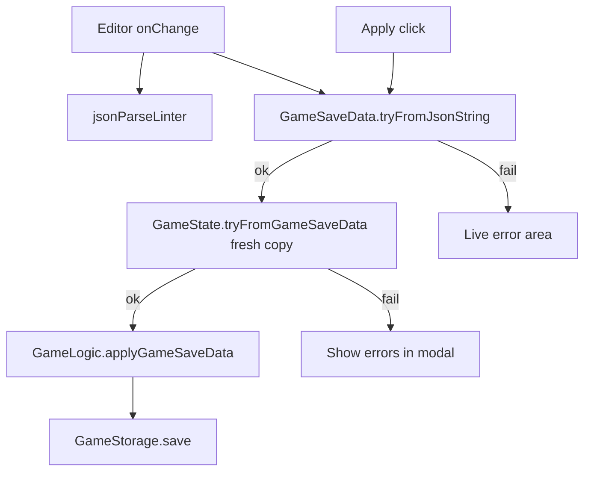

# PausedView: Edit save (updated architecture)

## What changed vs previous plan

- **Serialization home:** Plain-object parsing and pretty-printing move from private `[GameStorage](src/core/storage.ts)` helpers into a `**GameSaveData` class (today `[GameSaveData` is an interface](src/core/types/index.ts) — convert or introduce a class with the same name/shape and migrate call sites as needed).
- **Live validation:** On each editor change, only check **JSON syntax** (e.g. CodeMirror `jsonParseLinter`) plus **structural** conversion: string → `GameSaveData` (same rules as today’s `deserialize`: `JSON.parse`, required keys, arrays, `CubesResult` / turn shape). **Do not** call `GameState.tryFromGameSaveData` while typing (it mutates and replays turns).
- **Apply validation:** On **Apply** only, run `**GameState.tryFromGameSaveData**` on a **fresh** payload (re-parse from string or deep clone) so the live game and editor buffer are never mutated by a failed deep validation.
- `**GameLogic` apply: **Add** a method such as `applyGameSaveData(data: GameSaveData): { ok: true } | { ok: false; errors: string[] }` in `[src/core/game-logic.ts](src/core/game-logic.ts)`. On success: replace internal `_gameState`, persist via `_storage.save`, reset/sync `_turnTimer` from the new current turn, and call `_setStatus(Paused)` so the user remains paused. On failure: return `errors` for the modal. **Remove** the old plan line that said not to add an apply method on `GameLogic`.

## 1. `GameSaveData` class responsibilities

Place in `[src/core/types/index.ts](src/core/types/index.ts)` (or a small sibling module re-exported from the barrel) so the rest of `core` imports stay coherent.

Suggested API (names can be adjusted to match project style):

- `**GameSaveData.tryFromJsonString(text: string)**` → `{ ok: true; data: GameSaveData } | { ok: false; errors: string[] }`
  - Covers `JSON.parse` failures and structural/type reconstruction (logic lifted from `[GameStorage.deserialize](src/core/storage.ts)` today).
  - **Non-throwing**; suitable for running on **every keystroke** from the editor (debouncing optional for perf).
- `**GameSaveData.toJsonString(data: GameSaveData, pretty?: boolean)**` (or instance method if all saves are class instances)
  - Logic lifted from `[GameStorage.serialize](src/core/storage.ts)` (plain object + `CubesResult` fields).

`[GameStorage.save](src/core/storage.ts)` / `load` should **delegate** to these methods instead of owning duplicate parse/stringify.

## 2. Editor UX: two error channels

| When       | What runs                                            | Purpose                                                 |
| ---------- | ---------------------------------------------------- | ------------------------------------------------------- |
| Every edit | `jsonParseLinter` + `GameSaveData.tryFromJsonString` | Valid JSON + can we build **structural** `GameSaveData` |
| Apply only | `GameState.tryFromGameSaveData(freshData)`           | Deep / replay validation                                |

- **Disable Apply** when live structural parse is not `ok` (and optionally when JSON is incomplete).
- **Apply button handler:** if structural ok, `const deep = GameState.tryFromGameSaveData(cloneOfStructuralData)`; if `!deep.ok`, show `deep.errors` in the modal; if ok, call `**gameLogic.applyGameSaveData(...)**` with the same structural object you validated (or pass data from `deep.state` only if you have a clear rule for extracting non-mutated save payload — safest is **re-parse from editor string** right before apply so `tryFrom` always sees a disposable object).

## 3. `GameLogic.applyGameSaveData` behavior

Sketch aligned with existing constructor / `[newGame](src/core/game-logic.ts)` patterns:

1. Prepare disposable `GameSaveData` (re-parse from JSON string from editor, or structured clone if all fields are JSON-safe — note `CubesResult` class instances: prefer **string round-trip** or explicit clone helper next to `GameSaveData`).
2. `const result = GameState.tryFromGameSaveData(disposable)`.
3. If `!result.ok` → return `{ ok: false, errors: result.errors }`.
4. If ok → assign `this._gameState = result.state`, `_save()`, reset timer from `getCurrentTurn()?.turnDuration`, `resume()` then `pause()` (or equivalent) so status is **Paused** and duration is consistent — mirror the “new instance + pause” intent from the previous plan without replacing the React `gameLogic` reference.

**React re-renders:** Mutating `GameLogic` in place does not trigger re-render if the component still holds the same object reference. After a successful apply, **App** (or PausedView callback) should bump a small `version` state or pass a `key` to force subtree refresh — document this in implementation (optional alternative: keep `useState` for `GameLogic` and still `new GameLogic(...)` on apply; user preference here was in-place state swap + errors from `GameLogic`, so the **tick/version** pattern is the minimal UI fix).

## 4. Other items unchanged from the prior plan

- CodeMirror 6 deps, **Edit save** entry (**e**), modal, ActionBar ignore shortcuts when focus is in `.cm-editor`, `[App](src/components/App/App.tsx)` wiring for callbacks.
- Tests: existing `[game-state.test.ts](src/core/__tests__/game-state.test.ts)` for `tryFrom`; add focused tests for `GameSaveData.tryFromJsonString` (valid/invalid JSON, missing keys, bad turn shape).

## 5. Flow diagram

## 6. Todo alignment (for implementation)

- Replace loose todo **“JSON.parse + plain to GameSaveData”** with `**GameSaveData` class: `tryFromJsonString` + `toJsonString`, migrate `GameStorage**`.
- Replace **“Expose formatted JSON on GameStorage”** with **seed editor via `GameSaveData.toJsonString(gameLogic.state.gameSaveData)**` (storage helper optional).
- Add todo: `**GameLogic.applyGameSaveData` + post-apply pause/timer + App re-render tick.
- Keep: CodeMirror deps, ActionBar `.cm-editor` guard, PausedView UI, `GameState.tryFromGameSaveData` (already done).
