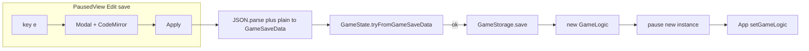

# PausedView: Edit save (localStorage JSON)

## Context

- Save shape is `[GameSaveData](src/core/types/index.ts)`: `players`, `blockedResults`, `gameTurns`; each turn has `turnNumber`, `playerIndex`, `cubes` (`yellowCube`, `redCube`, optional `predetermined`), `eventsCube`, `turnDuration`.
- Persistence: `[GameStorage](src/core/storage.ts)` (`serialize` / `deserialize`, key `catan-game-save`). Serialize is **private**; expose a **public** pretty-print helper (e.g. `GameStorage.toJsonString(data: GameSaveData)`) for seeding the editor.
- `[GameLogic](src/core/game-logic.ts)` constructor: with `initialData` and non-empty turns, initial status is **InProgress** and the turn timer `**resume()`s** (see constructor around lines 56–66). Replacing `GameLogic` after a successful edit must `**pause()**` the **new instance so the user stays paused and `[App](src/components/App/App.tsx)` mode stays `Paused`.
- `[GameState](src/core/types/game-state.ts)` **mutates** the object passed into its constructor. Always pass a **fresh deep copy** into any new `GameLogic` / `GameState` construction path.
- `[ActionBar](src/components/Common/ActionBar/ActionBar.tsx)`: extend focus guard for CodeMirror (e.g. `target.closest('.cm-editor')`).
- `[Modal](src/components/Common/Modal/Modal.tsx)`: existing Space handling; Cancel via Esc as today.

## Feature naming: **Edit save**

- User-facing action label: **Edit save** (shortcut **e** in paused **Normal** mode, in `[PausedView.tsx](src/components/PausedView/PausedView.tsx)`).
- Internal `ViewMode` can stay e.g. `'EditSave'` or align naming with the feature.

## UX

- Modal: large editor, title for **Edit save**, error area under the editor (JSON syntax + validation).
- Action bar: **Apply** (no keyboard shortcut); **Cancel** (`Esc`). Disable **Apply** when JSON/validation fails.

## JSON editor + highlighting

- CodeMirror 6 stack: `@uiw/react-codemirror`, `@codemirror/lang-json`, `@codemirror/lint`, optional theme package.
- `jsonParseLinter` for syntax; semantic messages from validation below the editor.

## Validation: `GameState.tryFromGameSaveData`

Static factory on `[GameState](src/core/types/game-state.ts)`:

```ts
type TryFromResult =
  | { ok: true; state: GameState }
  | { ok: false; errors: string[] }
```

- **Fail-fast:** at most **one** message in `errors` for now; keep `errors` as `string[]` for future multi-error.
- **Follow-up:** collect more errors inside `GameState` / helpers without changing the result shape.

**Pipeline before `tryFrom`:**

1. `JSON.parse` editor text.
2. Plain object → `GameSaveData` (aligned with `[deserialize](src/core/storage.ts)`), optional strict unknown-key checks.

**Editor rule:** `gameTurns.length >= 1` when applying from pause (document in `tryFrom` or immediately before it).

**Intended rules** (expand over time):

- Root keys only: `players`, `blockedResults`, `gameTurns`.
- Players: non-empty, trimmed non-empty names, unique.
- `blockedResults`: unique ints in 2–12; set ≠ full 2..12.
- Turns: sequential `turnNumber` from 1; circular `playerIndex`; cubes 1–6; `predetermined` if present must be `true`; `eventsCube` 0–3; `turnDuration` ≥ 0.

## Apply flow: **no** `GameLogic.applySaveDataFromEditor`

Do **not** add a mutating apply method on `GameLogic`.

On **Apply** success:

1. `const result = GameState.tryFromGameSaveData(data)` (with `data` built from a **deep copy** / freshly deserialized object so nothing shared with the old instance).
2. If `!result.ok`, show `result.errors` and stop.
3. Extract save payload suitable for persistence and for the constructor (e.g. clone from `result.state.gameSaveData` in a form `GameLogic` / `GameState` accept — remember mutation in `GameState` constructor).
4. `**GameStorage.save(...)**` — required because `[GameLogic](src/core/game-logic.ts)` constructor does **not** call `_save()` when `initialData` is provided; localStorage must be updated explicitly.
5. `**const next = new GameLogic(storageKey, saveData, onGameModeChange)**` — same callback as today (`setGameMode` from App).
6. `**next.pause()**` — new instance starts **InProgress** with a running timer; calling `**pause()**` matches “user was editing while paused” and updates status via `_setStatus` so `**gameMode` stays `Paused**`.
7. Replace the React-owned instance: e.g. `**setGameLogic(next)**` (and ensure `**setOnGameModeChange**` is wired if you create the instance before the effect runs — simplest is passing `setGameMode` into the constructor and not needing a separate effect for the new instance, same as first load).

## App architecture change

Today `[App.tsx](src/components/App/App.tsx)` uses `**useMemo(() => new GameLogic(...), [])**`. That must change so the instance can be replaced:

- Hold `**GameLogic` in `useState**`, with initial value from the same logic as today (storage key, mock flag, `setGameMode`).
- Pass `**setGameLogic**` (or a small `**onEditSaveApplied(save: GameSaveData)**` wrapper) into `**PausedView**` along with `**storageKey**` / `**setGameMode**` as needed.

## `PausedView` wiring

- Open **Edit save**: seed editor from `GameStorage.toJsonString(gameLogic.state.gameSaveData)`.
- **Apply**: parse → `GameSaveData` → `tryFrom` → on success parent replaces `GameLogic` + persist + pause (as above); on failure show errors.
- **Cancel / Esc**: discard, return to Normal paused UI.

## Tests

- Vitest: `GameState.tryFromGameSaveData` happy path and fail-fast errors.
- Optional: thin tests for parse + plain-to-save if extracted.

## Dependency summary

`@uiw/react-codemirror`, `@codemirror/state`, `@codemirror/view`, `@codemirror/lang-json`, `@codemirror/lint`, optional theme.


