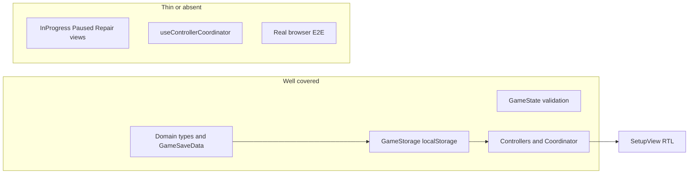

# Test suite status and expansion plan

## Completed since last revision

- **[SetupView.test.tsx](src/components/SetupView/SetupView.test.tsx)** (2 tests): empty setup shows `GameSaveData.validateSetup` copy; add player → Start → confirm long-press → `startGame` called with expected `GameState`. Uses real [SetupController](src/core/controllers/concrete/SetupController.ts) + [GameStorage](src/core/GameStorage.ts) + unique `localStorage` keys (same style as [Controllers.setupInProgress.test.ts](src/core/__tests__/Controllers.setupInProgress.test.ts)).
- **Production hardening (tests / happy-dom):** [ActionButton.tsx](src/components/Common/ActionBar/ActionButton.tsx) parses `--long-press-*` with fallbacks; [ProgressBorder.tsx](src/components/Common/ActionBar/ProgressBorder.tsx) clamps invalid `strokeWidth` and `borderRadius`. Removes NaN `strokeWidth` warnings during long-press in tests.

---

## Current tooling

| Piece    | Details                                                                                                                         |
| -------- | ------------------------------------------------------------------------------------------------------------------------------- |
| Runner   | [Vitest 4](https://vitest.dev/) (`npm test` / `npm run test:run` in [package.json](package.json))                               |
| DOM      | `happy-dom` via [vitest.config.ts](vitest.config.ts)                                                                            |
| React    | `@testing-library/react`, `@testing-library/user-event`, `@testing-library/jest-dom` ([src/vitestSetup.ts](src/vitestSetup.ts)) |
| Coverage | `vitest run --coverage` with v8 ([vitest.config.ts](vitest.config.ts)); not part of default `check` script                      |
| CI       | No `.github/workflows` found in the workspace snapshot                                                                          |

**Test types in use:** **unit** and **narrow integration** (including real `localStorage` for `GameStorage` / coordinator-style tests) plus **RTL component** tests for Common components and SetupView.

---

## What is covered (14 files)

**Core domain and types** — [src/core/**tests**/](src/core/__tests__/)

- [types.test.ts](src/core/__tests__/types.test.ts): `EventsCubeResult` (random distribution, `fromFaceNumber`), `CubesResult`.
- [GameState.test.ts](src/core/__tests__/GameState.test.ts): `GameState.tryFromGameSaveData` validation paths.
- [GameSaveData.json.test.ts](src/core/__tests__/GameSaveData.json.test.ts): JSON parse/serialize round-trips and error cases.
- [GameSaveData.validateSetup.test.ts](src/core/__tests__/GameSaveData.validateSetup.test.ts): setup validation messages and rules.

**Persistence** — [storage.test.ts](src/core/__tests__/storage.test.ts): `GameStorage` (`exists`, `createNewGame`, `save`/`load`, invalid JSON, etc.).

**Controllers and coordinator**

- [ControllerCoordinator.initial.test.ts](src/core/__tests__/ControllerCoordinator.initial.test.ts): bootstrap from empty storage, bad JSON, valid save, paused flag branches.
- [ControllerCoordinator.editSave.test.ts](src/core/__tests__/ControllerCoordinator.editSave.test.ts): `editSave` transitions (e.g. in-progress → repair with `canCancel`).
- [Controllers.setupInProgress.test.ts](src/core/__tests__/Controllers.setupInProgress.test.ts): `SetupController` persistence + `startGame`; `InProgressController` behavior (with `Math.random` mocked).
- [PausedController.test.ts](src/core/__tests__/PausedController.test.ts): pause menu actions / predetermined cubes path.
- [RepairSaveController.test.ts](src/core/__tests__/RepairSaveController.test.ts): structural validation, `setRawSaveText`, apply/cancel callbacks.

**UI**

- **Shared:** [ActionBar.test.tsx](src/components/Common/ActionBar/__tests__/ActionBar.test.tsx), [ActionButton.test.tsx](src/components/Common/ActionBar/__tests__/ActionButton.test.tsx), [Modal.test.tsx](src/components/Common/Modal/__tests__/Modal.test.tsx).
- **Feature:** [SetupView.test.tsx](src/components/SetupView/SetupView.test.tsx).

---

## Gaps (what is not tested today)

- **Other feature views:** [InProgressView](src/components/InProgressView/InProgressView.tsx), [PausedView](src/components/PausedView/PausedView.tsx), [RepairSaveView](src/components/RepairSaveView/RepairSaveView.tsx) — no dedicated RTL tests yet.
- **App integration:** [useControllerCoordinator.ts](src/components/App/useControllerCoordinator.ts) mounts [ControllerCoordinator](src/core/controllers/coordinator/ControllerCoordinator.ts) with default [GameStorage](src/core/GameStorage.ts) (`DEFAULT_GAME_STORAGE_KEY`) — not covered by a test that exercises this path end-to-end from React.
- **Broader `InProgressController` UX / coverage report:** optional `npm run test:coverage` sweep.
- **Cross-browser / E2E / CI / a11y:** unchanged from earlier plan (optional).

---

## Plan to add more test types (prioritized)

1. **Hook test for `useControllerCoordinator**` (recommended next minimal step — see below).
2. **RTL smoke for other main views** (same pattern as SetupView: real controller + storage or thin mocks).
3. **Coverage-driven unit gaps** on coordinator / in-progress paths.
4. **Optional:** Vitest browser mode, E2E, CI workflow, axe.

---

## Phased rollout

### Done (Step 1)

SetupView RTL + ActionBar/ProgressBorder CSS fallbacks (see **Completed since last revision**).

### Recommended next minimal step (Step 2)

Add **[src/components/App/useControllerCoordinator.test.ts](src/components/App/useControllerCoordinator.test.ts)** (or `.tsx`) with `**renderHook**` from `@testing-library/react`:

- `**beforeEach`: `localStorage.removeItem(DEFAULT_GAME_STORAGE_KEY)` (import key from [GameStorage.ts](src/core/GameStorage.ts)) so the hook sees the same “clean” default as a fresh tab.
- **Test 1:** `const { result } = renderHook(() => useControllerCoordinator())` → `await waitFor(() => expect(result.current).not.toBeNull())` → expect `SetupController`, `appMode()` setup (mirror assertions from [ControllerCoordinator.initial.test.ts](src/core/__tests__/ControllerCoordinator.initial.test.ts) for empty storage).
- **Optional second test:** seed `localStorage` with a minimal valid one-turn JSON (reuse fixtures from coordinator tests), re-run hook, assert `InProgressController` (or paused if you seed that flag — only if cheap).

**Why this step:** Smallest increment that covers the **React entry path** (`useMemo` coordinator + `useEffect` initial controller) and the **default storage key**, without duplicating all coordinator tests. Unblocks confidence in [App.tsx](src/components/App/App.tsx) wiring before investing in more view-level RTL.

**Then:** RTL smoke on `InProgressView` (or `RepairSaveView`), `npm run test:coverage`, or a one-file GitHub Actions workflow for `npm run check`.

---

## Suggested success criteria

- **Short term:** hook test for `useControllerCoordinator`; at least one RTL test per major screen (setup done; in-progress / pause / repair still open).
- **Medium term:** coverage report reviewed for coordinator + in-progress paths; CI running `check`.
- **Long term (if needed):** one E2E smoke + optional browser-mode tests for highest-risk interactions.
