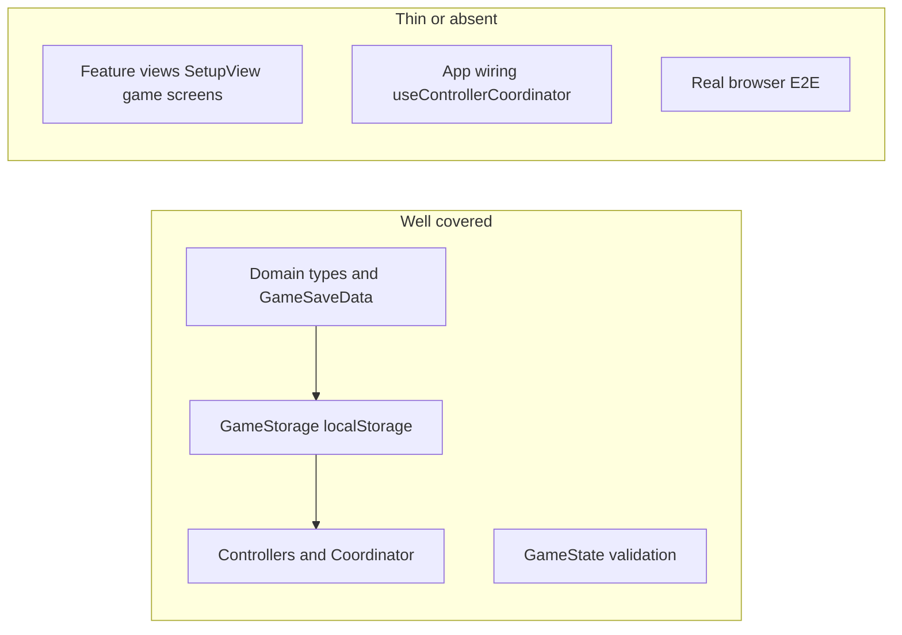

# Test suite status and expansion plan

## Current tooling

| Piece    | Details                                                                                                                         |
| -------- | ------------------------------------------------------------------------------------------------------------------------------- |
| Runner   | [Vitest 4](https://vitest.dev/) (`npm test` / `npm run test:run` in [package.json](package.json))                               |
| DOM      | `happy-dom` via [vitest.config.ts](vitest.config.ts)                                                                            |
| React    | `@testing-library/react`, `@testing-library/user-event`, `@testing-library/jest-dom` ([src/vitestSetup.ts](src/vitestSetup.ts)) |
| Coverage | `vitest run --coverage` with v8 ([vitest.config.ts](vitest.config.ts)); not part of default `check` script                      |
| CI       | No `.github/workflows` found in the workspace snapshot                                                                          |

**Test types in use:** effectively **unit** and **narrow integration** tests (modules tested in isolation; `GameStorage` and coordinator tests hit **real `localStorage**` with per-test keys and cleanup).

---

## What is covered (13 files)

**Core domain and types** — [src/core/**tests**/](src/core/__tests__/)

- [types.test.ts](src/core/__tests__/types.test.ts): `EventsCubeResult` (random distribution, `fromFaceNumber`), `CubesResult`.
- [GameState.test.ts](src/core/__tests__/GameState.test.ts): `GameState.tryFromGameSaveData` validation paths.
- [GameSaveData.json.test.ts](src/core/__tests__/GameSaveData.json.test.ts): JSON parse/serialize round-trips and error cases.
- [GameSaveData.validateSetup.test.ts](src/core/__tests__/GameSaveData.validateSetup.test.ts): setup validation messages and rules.

**Persistence** — [storage.test.ts](src/core/__tests__/storage.test.ts): `GameStorage` (`exists`, `createNewGame`, `save`/`load`, invalid JSON, etc.).

**Controllers and coordinator**

- [ControllerCoordinator.initial.test.ts](src/core/__tests__/ControllerCoordinator.initial.test.ts): bootstrap from empty storage, bad JSON, valid save, paused flag branches.
- [ControllerCoordinator.editSave.test.ts](src/core/__tests__/ControllerCoordinator.editSave.test.ts): `editSave` transitions (e.g. in-progress → repair with `canCancel`).
- [Controllers.setupInProgress.test.ts](src/core/__tests__/Controllers.setupInProgress.test.ts): `SetupController` persistence + `startGame`; `InProgressController` behavior (with `Math.random` mocked).
- [PausedController.test.ts](src/core/__tests__/PausedController.test.ts): pause menu actions / predetermined cubes path.
- [RepairSaveController.test.ts](src/core/__tests__/RepairSaveController.test.ts): structural validation, `setRawSaveText`, apply/cancel callbacks.

**UI (shared components only)** — [src/components/Common/](src/components/Common/)

- [ActionBar.test.tsx](src/components/Common/ActionBar/__tests__/ActionBar.test.tsx), [ActionButton.test.tsx](src/components/Common/ActionBar/__tests__/ActionButton.test.tsx): keyboard shortcuts and CodeMirror focus guard.
- [Modal.test.tsx](src/components/Common/Modal/__tests__/Modal.test.tsx): render + spacebar `preventDefault` on `window`.

---

## Gaps (what is not tested today)

- **Feature views**: e.g. [SetupView.tsx](src/components/SetupView/SetupView.tsx), game-specific components under `src/components/` — no tests.
- **App integration**: [useControllerCoordinator.ts](src/components/App/useControllerCoordinator.ts) and top-level flow (mode switching, error boundaries if any) — not exercised by tests.
- **Broader `InProgressController` / `SetupController` UX paths**: only a subset of behaviors are covered; edge cases can be added where bugs appear.
- **Cross-browser / full stack**: no Playwright/Cypress (only transitive `@vitest/browser-playwright` in lockfile; not configured in [vitest.config.ts](vitest.config.ts)).
- **Non-functional**: no performance, a11y automation, or visual regression tests.
- **CI**: no automated gate visible in-repo (local `npm run check` includes tests).

---

## Plan to add more test types (prioritized)

1. **RTL integration tests for feature views**
   Mount `SetupView` (and other main screens) with mocked coordinator/controller props or a thin test double; assert validation messages, button states, and that user actions call the right callbacks. Keeps the same stack as today.
2. **Hook / wiring tests**
   Test `useControllerCoordinator` with `renderHook` + mocked `GameStorage` (or in-memory/localStorage) to assert initial mode and transitions without full E2E.
3. **Coverage-driven unit gaps**
   Run `npm run test:coverage`, identify hot paths in [InProgressController.ts](src/core/controllers/concrete/InProgressController.ts) and untested branches in [ControllerCoordinator.ts](src/core/controllers/coordinator/ControllerCoordinator.ts); add focused tests (same style as existing coordinator tests).
4. **Optional: Vitest Browser mode**
   If keyboard/focus behavior is flaky in happy-dom vs Chrome, add a small `@vitest/browser` + Playwright project for a few critical UI tests (ActionBar already tests focus; this would be validation in a real browser).
5. **Optional: E2E (Playwright or Cypress)**
   A minimal smoke suite: open app, create game, one turn, reload, assert persistence — catches Vite build + routing + storage regressions that unit tests miss.
6. **Optional: CI**
   Add a workflow that runs `npm run check` (or `lint` + `typecheck` + `test:run`) on push/PR.
7. **Optional: Accessibility**
   `vitest-axe` or `@axe-core/react` in RTL tests for Setup and main game shell.

---

## Suggested success criteria

- **Short term:** at least one integration test per major screen (setup, in-progress, pause/repair if routed through views).
- **Medium term:** coverage report reviewed for coordinator + in-progress paths; CI running `check`.
- **Long term (if needed):** one E2E smoke + optional browser-mode tests for highest-risk interactions.
