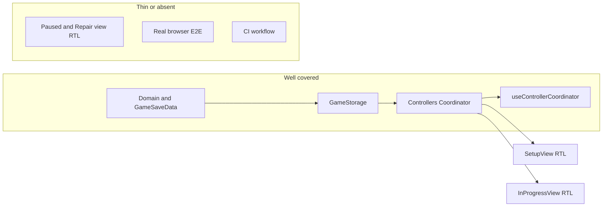

# Test suite status and expansion plan

## Completed (recent)

- **[SetupView.test.tsx](src/components/SetupView/SetupView.test.tsx)** (2 tests): validation copy when no players; add player → Start → long-press Yes → `startGame`. Real [SetupController](src/core/controllers/concrete/SetupController.ts) + [GameStorage](src/core/GameStorage.ts).
- **Long-press / happy-dom:** [ActionButton](src/components/Common/ActionBar/ActionButton.tsx) + [ProgressBorder](src/components/Common/ActionBar/ProgressBorder.tsx) use shared **[CssFallback](src/utils/CssFallback.ts)** (`positiveIntOr`, `nonEmptyTrimmedOr`).
- **[useControllerCoordinator.test.tsx](src/components/App/useControllerCoordinator.test.tsx)** (2 tests): `renderHook` + `DEFAULT_GAME_STORAGE_KEY` cleanup; default save → `SetupController`; seeded one-turn JSON → `InProgressController`.
- **[InProgressView.test.tsx](src/components/InProgressView/InProgressView.test.tsx)** (1 test): real [InProgressController](src/core/controllers/concrete/InProgressController.ts) + [GameStorage](src/core/GameStorage.ts) (unique key), `Math.random` mocked; asserts Alice / “to play”, **Events cube** cell shows `GREEN` (`within` — statistics table also lists `GREEN`), Pause + Next Turn buttons.

---

## Current tooling

| Piece    | Details                                                                                                                         |
| -------- | ------------------------------------------------------------------------------------------------------------------------------- |
| Runner   | [Vitest 4](https://vitest.dev/) (`npm test` / `npm run test:run` in [package.json](package.json))                               |
| DOM      | `happy-dom` via [vitest.config.ts](vitest.config.ts)                                                                            |
| React    | `@testing-library/react`, `@testing-library/user-event`, `@testing-library/jest-dom` ([src/vitestSetup.ts](src/vitestSetup.ts)) |
| Coverage | `vitest run --coverage` with v8 ([vitest.config.ts](vitest.config.ts)); not part of default `check` script                      |
| CI       | No `.github/workflows` found in the workspace snapshot                                                                          |

**Test types in use:** **unit** and **narrow integration** (real `localStorage`), **RTL** for components, `**renderHook**` for [useControllerCoordinator](src/components/App/useControllerCoordinator.ts).

---

## What is covered (16 files)

**Core** — [src/core/**tests**/](src/core/__tests__/): types, `GameState`, `GameSaveData` JSON + `validateSetup`, `storage`, coordinator (initial + editSave), setup/in-progress, paused, repair controllers.

**UI / App**

- Shared: [ActionBar](src/components/Common/ActionBar/__tests__/), [Modal](src/components/Common/Modal/__tests__/).
- Feature: [SetupView.test.tsx](src/components/SetupView/SetupView.test.tsx), [InProgressView.test.tsx](src/components/InProgressView/InProgressView.test.tsx).
- App hook: [useControllerCoordinator.test.tsx](src/components/App/useControllerCoordinator.test.tsx).

**Utils (no dedicated test file yet):** [CssFallback.ts](src/utils/CssFallback.ts) — covered indirectly via ActionBar / SetupView long-press paths.

---

## Gaps

- **Feature views (RTL):** [PausedView](src/components/PausedView/PausedView.tsx), [RepairSaveView](src/components/RepairSaveView/RepairSaveView.tsx) (lazy in [App](src/components/App/App.tsx)) — no view-level tests yet.
- **App.tsx** mode switch — not smoke-tested end-to-end; hook + per-view tests cover pieces.
- **Coverage sweep, E2E, CI, a11y** — optional.

---

## Prioritized backlog

1. **PausedView** RTL smoke (Step 4 below) — same pattern as InProgressView; no lazy import.
2. **RepairSaveView** RTL (wrap `Suspense` + `vi.mock` or small integration) or **SetupView** “Edit save”.
3. `npm run test:coverage` + targeted unit gaps.
4. Optional: Vitest browser, Playwright smoke, **GitHub Actions** for `npm run check`, axe.

---

## Phased rollout

### Done

- Steps 1–3: SetupView RTL, CssFallback + ActionBar, hook tests, **InProgressView RTL**.

### Recommended next minimal step (Step 4)

Add **[src/components/PausedView/PausedView.test.tsx](src/components/PausedView/PausedView.test.tsx)** with **one** RTL test:

- Build [PausedController](src/core/controllers/concrete/PausedController.ts) like [PausedController.test.ts](src/core/__tests__/PausedController.test.ts) / [Controllers.setupInProgress.test.ts](src/core/__tests__/Controllers.setupInProgress.test.ts): `GameState` with at least one turn, `GameStorage` + unique key, `vi.fn()` for `resume`, `newGame`, `editSave`, `nextTurnWithPredeterminedCubes`.
- `render(<PausedView controller={...} />)` → assert one or two stable strings or action labels from the real UI.

**Alternative:** `.github/workflows/ci.yml` with `npm ci` and `npm run check` on push/PR (no new view coverage).

### Then

RepairSaveView RTL, coverage-driven tests, or E2E.

---

## Suggested success criteria

- **Short term:** RTL smoke per major screen (setup and in-progress **done**; **pause next**).
- **Medium term:** coverage review + CI on `check`.
- **Long term (if needed):** one E2E smoke + optional browser-mode tests.
