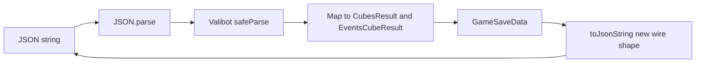

# Valibot-based GameSave JSON (new wire format)

## Scope

- **Public API unchanged:** `[GameSaveData.tryFromJsonString](src/core/types/index.ts)` and `[toJsonString](src/core/types/index.ts)` keep the same signatures and `{ ok, data | errors }` result shape.
- **In-memory model unchanged:** `[GameTurn](src/core/types/index.ts)` still uses `cubes: CubesResult` and `eventsCube: EventsCubeResult` (numeric singletons). Only **JSON** changes.
- **Breaking wire format:** Existing `localStorage` saves that use nested `cubes` and numeric `eventsCube` will **fail** structural parse until cleared or manually migrated. Call this out in the plan; no backward-compat branch unless you ask for it later.

## New JSON shape (per turn)

```json
{
  "turnNumber": 1,
  "playerIndex": 0,
  "yellowCube": 3,
  "redCube": 4,
  "predetermined": true,
  "eventsCube": "GREEN",
  "turnDuration": 5
}
```

- `predetermined` optional (omit or `false` for normal rolls).
- `eventsCube`: exactly one of `"GREEN" | "BLUE" | "YELLOW" | "PIRATES"`.

Root object unchanged conceptually: `players: string[]`, `blockedResults: number[]`, `gameTurns: TurnJson[]`.

## Implementation steps

### 1. Add dependency

- Add `**valibot**` to `[package.json](package.json)` `dependencies` (runtime: used by save/load and any `tryFromJsonString` callers).

### 2. Schema module (keep `[index.ts](src/core/types/index.ts)` readable)

- Add something like `[src/core/game-save-json-schema.ts](src/core/game-save-json-schema.ts)` (name flexible) that defines:
  - `eventsCubeLabelSchema` — `picklist(['GREEN','BLUE','YELLOW','PIRATES'])` (or equivalent).
  - `gameTurnJsonSchema` — required `turnNumber`, `playerIndex`, `turnDuration`, `yellowCube`, `redCube`, optional `predetermined`, `eventsCube` as above.
  - `gameSaveJsonSchema` — `players` (array of strings), `blockedResults` (array of numbers), `gameTurns` (array of turn schema).

**Coercion (match current behavior):** Today `[parsePlainObject](src/core/types/index.ts)` uses `Number(...)` for cube faces. Use Valibot `pipe`/`transform` (or union number + string coerced to number) so hand-edited JSON that stores `"3"` still works, if you want parity; otherwise strict `number()` only.

### 3. Map validated output → domain

- After `safeParse(gameSaveJsonSchema, plain)` succeeds, map each turn to:
  - `cubes: new CubesResult(yellow, red, predetermined?)`
  - `eventsCube: <EventsCubeResult static>`
- Add a small **string → `EventsCubeResult**`helper on`[EventsCubeResult](src/core/types/index.ts)`(e.g.`fromLabel('GREEN')`returning the static member, or throw). This pairs with existing`[getName](src/core/types/index.ts)` for serialization.

### 4. Wire into `GameSaveData`

- Replace `parsePlainObject` implementation with: `JSON.parse` (unchanged try/catch) → `safeParse` → on failure, map Valibot `issues` to `string[]` (path + message, similar tone to current errors).
- Update `toJsonString` to emit the **new** turn shape: flatten `turn.cubes.*` to top-level keys; set `eventsCube` to `EventsCubeResult.getName(turn.eventsCube)` (already returns `GREEN`, etc.).

### 5. Tests

- Add a focused test file (e.g. `[src/core/__tests__/game-save-data-json.test.ts](src/core/__tests__/game-save-data-json.test.ts)`) for:
  - Valid minimal + multi-turn JSON → `ok: true` and expected `GameSaveData` / `CubesResult` / `eventsCube` identity.
  - Invalid: bad `eventsCube` string, missing fields, wrong root type.
  - **Round-trip:** `new GameSaveData(...)` → `toJsonString` → `tryFromJsonString` → deep equality on structure (turns, cube values, predetermined, events cube).
- Existing `[storage.test.ts](src/core/__tests__/storage.test.ts)` and `[game-state.test.ts](src/core/__tests__/game-state.test.ts)` should keep passing (they never assert raw JSON text).

### 6. Docs / UX (optional one-liner)

- If you document the edit-save JSON anywhere (e.g. plan or UI copy), update the example to the new turn shape.

## Architecture (data flow)



## Out of scope (unless requested)

- Reading old nested-`cubes` / numeric-`eventsCube` saves (migration or dual parser).
- Changing `[GameState.tryFromGameSaveData](src/core/types/game-state.ts)` (it already works on `GameSaveData` instances).
